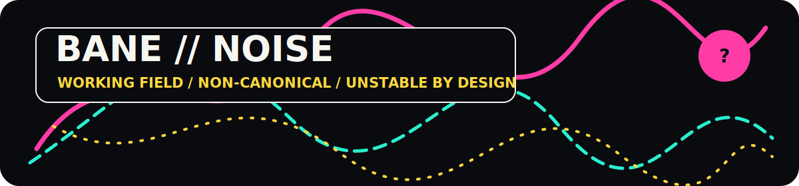

<p align="center">
  
</p>

<h1 align="center">Epistemic Architectures — Notes</h1>

<p align="center">
  <strong>BANE // NOISE</strong><br />
  Working notes, extensions, sketches, counterexamples, and future drafts around the canonical theory anchor.
</p>

<p align="center">
  
  
  
</p>

## Enter the path-field

This repository is intentionally less polished and less stable than the canonical reference. It is where concepts may branch, collide, fail, be renamed, or acquire enough structure to be promoted.

```text
RAW NOTE → STRUCTURED CANDIDATE → REVIEW → PROMOTE / HOLD / ARCHIVE
```

Nothing becomes canonical merely because it appears here.

## What belongs here

- exploratory notes;
- architectural sketches;
- counterexamples and stress tests;
- examples and extensions;
- terminology experiments;
- future drafts;
- material awaiting promotion or rejection.

## Relationship to the canonical reference

The governed reference surface is:

➡️ [`sololys/epistemic-architectures`](https://github.com/sololys/epistemic-architectures)

Associated working-paper record:

➡️ [Zenodo DOI 10.5281/zenodo.18515422](https://doi.org/10.5281/zenodo.18515422)

Stable definitions, citation instructions, and descriptive architectural authority reside in the canonical repository. This notes repository may evolve, fragment, or be reorganized without notice.

## Promotion grammar

```text
BANE // NOISE
    ↓ editorial compression
Πₖ // STRUCTURE
    ↓ explicit review
PUNKT // THEORY
```

Promotion requires deliberate editorial action. Copying, linking, or repeating a note does not upgrade its authority.

## Status contract

```text
CANONICAL=false
COMPLETE=false
CONSISTENT=not_guaranteed
CHANGE_EXPECTED=true
PHYSICAL_AUTHORITY=none
```

## Visual system

This repository is the maximalist half of the [`PUNKT // BANE`](https://github.com/sololys/epistemic-architectures/blob/main/BRAND_SYSTEM.md) identity: dense paths, unresolved alternatives, and visible uncertainty contained inside a clean editorial frame.

---

<p align="center"><code>EXPLORE FREELY / PROMOTE DELIBERATELY / NEVER CONFUSE LOCATION WITH AUTHORITY</code></p>
