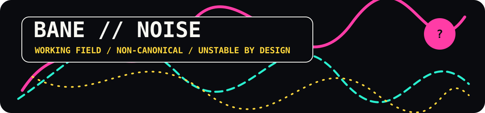

<p align="center">
  
</p>

<h1 align="center">Epistemic Architectures — Notes</h1>

<p align="center">
  <strong>BANE // NOISE</strong><br />
  Reviewed public notes and non-canonical abstractions that have passed the publication boundary.
</p>

<p align="center">
  
  
  
</p>

## 🏛️ Epistemic Foundation: Structural Containment of Intellectual Volatility

> *Within the study of epistemic architectures, the demarcation between canonical law and exploratory abstraction must be structurally enforced rather than merely intended. A repository of conceptual notes does not function as a foundation of operational truth, but as a deliberate containment field for intellectual volatility. It is the maximalist manifestation of the path-field—a domain where dense, unresolved trajectories and visible uncertainties are permitted to exist, provided they are rigorously bound by an editorial frame. Here, knowledge is not yet finalized; it is suspended in a state of deliberate non-resolution, demanding structural isolation to prevent the premature collapse of theoretical inquiry into accepted fact.*
>
> *This isolation is governed by a precise promotional grammar, a mechanism of architectural distillation that moves raw inquiry toward theoretical clarity. The environment accepts the chaotic yield of the exploratory workspace—the unstructured, the proprietary, and the speculative—and subjects it to the pressure of explicit structural review. Only through this deliberate compression can material ascend from the noise of generation to the public, theoretical stillness of a formalized reference. Nothing achieves canonical status through mere existence or repetition within the field; promotion requires a conscious, editorial severing of uncertainty, transferring only the verified abstraction across the boundary into canonical law.*
>
> *Consequently, every artifact held within this preliminary space operates under an absolute status contract: it is inherently incomplete, structurally volatile, and definitively stripped of physical authority. To document an architectural sketch or a theoretical proposition is an act of conceptual mapping, not operational command. The system enforces an uncompromising boundary where the generation of a hypothesis is permanently decoupled from realized consequence. No matter how sophisticated a theoretical model may become, its existence within this exploratory domain provides zero mandate to alter a physical state, ensuring that the theoretical remains mathematically bounded and harmlessly inert.*
>
> *The concepts contained within this field serve as the underlying philosophy for this structural containment, defining the exact limits of what a system is permitted to know. Governance emerges here not as a centralized source of truth, but as a strict boundary function designed to manage the profound tension between a system's capacity to learn and its tendency toward operational drift. True meta-awareness requires a system to relate to its own knowledge without collapsing that reflection into immediate control. By treating epistemic exposure as a calculated design decision rather than an inevitable vulnerability, the architecture establishes the ultimate safeguard: a framework that dictates not only what can be known, but what must remain permanently unknowable by design.*

---

## ⚡ The Path-Field Workflow

```text
RAW NOTE → STRUCTURED CANDIDATE → REVIEW → PROMOTE / HOLD / ARCHIVE
```

Nothing becomes canonical merely because it appears here. Draft status is public, not confidential.

## What belongs here

- reviewed abstraction-level notes;
- non-reconstructive architectural sketches;
- public counterexamples without protected method detail;
- terminology already admitted for public discussion;
- prose that contains no private topology, thresholds, corpus fingerprints, or implementation logic.

## Relationship to the canonical reference

The governed reference surface is:

➡️ [`sololys/epistemic-architectures`](https://github.com/sololys/epistemic-architectures)

Associated working-paper record:

➡️ [Zenodo DOI 10.5281/zenodo.18515422](https://doi.org/10.5281/zenodo.18515422)

Stable definitions, citation instructions, and descriptive architectural authority reside in the canonical repository. This notes repository may evolve, fragment, or be reorganized without notice.

## Promotion grammar

```text
BANE // NOISE
    ↓ editorial compression
Πₖ // STRUCTURE
    ↓ explicit review
PUNKT // THEORY
```

Promotion requires deliberate editorial action. Copying, linking, or repeating a note does not upgrade its authority.

## Status contract

```text
CANONICAL=false
COMPLETE=false
CONSISTENT=not_guaranteed
CHANGE_EXPECTED=true
PHYSICAL_AUTHORITY=none
```

## Visual system

This repository is the maximalist half of the [`PUNKT // BANE`](https://github.com/sololys/epistemic-architectures/blob/main/BRAND_SYSTEM.md) identity: dense paths, unresolved alternatives, and visible uncertainty contained inside a clean editorial frame.

---

<p align="center"><code>EXPLORE FREELY / PROMOTE DELIBERATELY / NEVER CONFUSE LOCATION WITH AUTHORITY</code></p>
